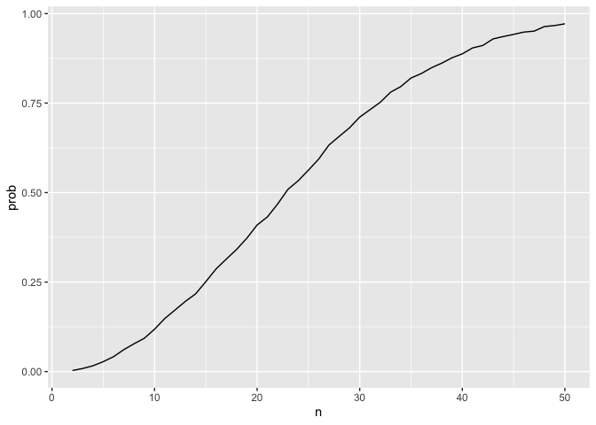
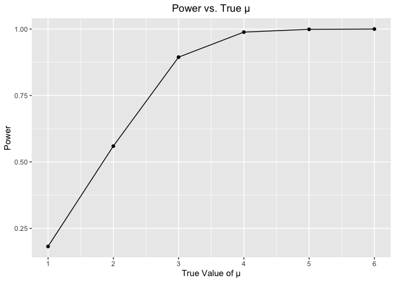
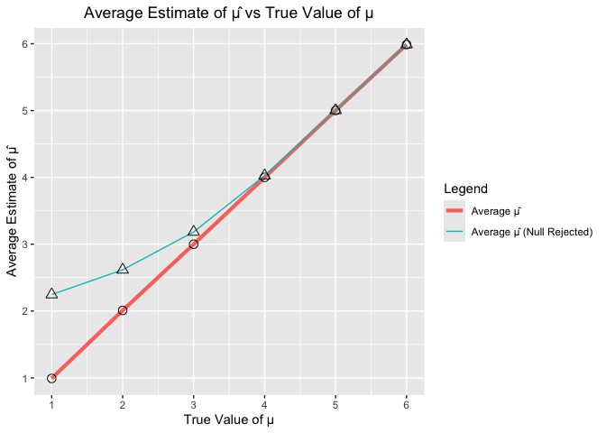
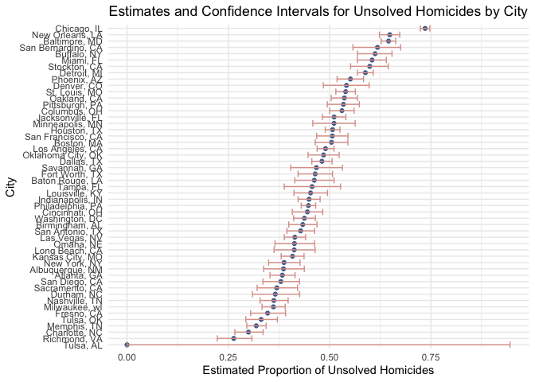

p8105_hw5_lx2346
================
linshan
2024-11-02

## Problem 1

### create a function to check whether there is a replicate

``` r
bdays_sim = function(n) {
  bdays = sample(1:365, size = n, replace = TRUE)
  length(unique(bdays)) < n
  duplicate = length(unique(bdays)) < n
  return(duplicate)
}
```

### run this function 10000 times for each group size between 2 and 50

``` r
sim_res = expand_grid(
  n = 2:50,
  iter = 1:10000
) |>
  mutate(res = map_lgl(n, bdays_sim)) |>
  group_by(n) |>
  summarize(prob = mean(res))

sim_res
```

    ## # A tibble: 49 × 2
    ##        n   prob
    ##    <int>  <dbl>
    ##  1     2 0.003 
    ##  2     3 0.0086
    ##  3     4 0.0162
    ##  4     5 0.0277
    ##  5     6 0.0415
    ##  6     7 0.0611
    ##  7     8 0.0777
    ##  8     9 0.0929
    ##  9    10 0.118 
    ## 10    11 0.148 
    ## # ℹ 39 more rows

### Make a plot showing the probability as a function of group size, and comment on your results.

``` r
sim_res |>
  ggplot(aes(x = n, y = prob)) +
  geom_line()
```

<!-- -->  
**Comment**:As the group size increases, the probability that two people
share the same birthday also increases. When n = 23， the probability
exceeds 0.5.

## Prblem 2

### Generate 5000 datasets from the model 𝑥∼𝑁𝑜𝑟𝑚𝑎𝑙\[𝜇,𝜎\]

``` r
normal_sim = function(miu = 0, sample_size = 30, sigma = 5) {
  sim_data = tibble(x_vec = rnorm(sample_size, miu , sigma))
  
  test_result = t.test(sim_data$x_vec, mu = 0)
  res_clean = broom::tidy(test_result)
  
  out_df = tibble(mu_hat = res_clean$estimate,
                  p_value = res_clean$p.value)
  
  return(out_df)
}
```

``` r
sim_res_2 = 
  tibble(
    iter = 1:5000
  )|>
  mutate(samp_res = map(iter, normal_sim)) |>
  unnest(samp_res)

sim_res_2
```

    ## # A tibble: 5,000 × 3
    ##     iter mu_hat  p_value
    ##    <int>  <dbl>    <dbl>
    ##  1     1  0.715 4.13e- 1
    ##  2     2  0.423 6.54e- 1
    ##  3     3  2.12  1.33e- 2
    ##  4     4  3.50  3.21e- 5
    ##  5     5  4.01  2.63e- 4
    ##  6     6  5.37  1.78e- 7
    ##  7     7  8.31  2.73e- 9
    ##  8     8  8.21  5.33e- 9
    ##  9     9  7.64  3.06e-10
    ## 10    10  8.98  7.20e-10
    ## # ℹ 4,990 more rows

### Repeat the above for 𝜇={1,2,3,4,5,6}

``` r
sim_res_3 = 
  expand_grid(
    n = c(1, 2, 3, 4, 5, 6),
    iter = 1:5000
  )|>
  mutate(samp_res = map(n, \(x) normal_sim(miu = x, sample_size = 30, sigma = 5))) |>
  unnest(samp_res)
```

### Make a plot showing the proportion of times the null was rejected (the power of the test) on the y axis and the true value of 𝜇 on the x axis.

``` r
sim_res_3 |>
  group_by(n) |>
  summarize(power = mean(p_value < 0.05)) |>
  ggplot(aes(x = n, y = power)) +
  geom_line() +
  geom_point() +
  labs(x = "True Value of μ", y = "Power", title = "Power vs. True μ") +
  theme(plot.title = element_text(hjust = 0.5)) +
  scale_x_continuous(breaks = seq(1, 6, by = 1))
```

<!-- -->
**Describe the association between effect size and power**: The effect
size is the difference between the true mean μ and the null hypothesis
(0). As we can see from the plot, there is a positive association
between effect size and power. As the effect size increases, the power
of the statistical test also increases. This is because larger effect
sizes are easier to detect against the backdrop of variability in the
data.

### Make a plot showing the average estimate of 𝜇̂ on the y axis and the true value of 𝜇 on the x axis + a second plot showing the average estimate of 𝜇̂ only in samples for which the null was rejected on the y axis and the true value of 𝜇 on the x axis.

``` r
mean_mu = sim_res_3 |>
  group_by(n) |>
  summarize(mean_mu = mean(mu_hat))

mean_mu_rej = sim_res_3 |>
  filter(p_value < 0.05) |>
  group_by(n) |>
  summarize(mean_mu_rej = mean(mu_hat))

mu_df = left_join(mean_mu, mean_mu_rej, by = "n")

mu_df |>
  ggplot(aes(x = n)) +
  geom_line(aes(y = mean_mu, color = "Average μ̂"), size = 1.5 )+
  geom_point(aes(y = mean_mu), shape = 1, size = 3) +
  geom_line(aes(y = mean_mu_rej,color = "Average μ̂ (Null Rejected)"))+
  geom_point(aes(y = mean_mu_rej), shape = 2, size = 3) +
  labs(title = "Average Estimate of μ̂ vs True Value of μ",
       x = "True Value of μ",
       y = "Average Estimate of μ̂",
       color = "Legend") +
  theme(plot.title = element_text(hjust = 0.5)) +
  scale_x_continuous(breaks = seq(1, 6, by = 1)) +
  scale_y_continuous(breaks = seq(1, 6, by = 1))
```

    ## Warning: Using `size` aesthetic for lines was deprecated in ggplot2 3.4.0.
    ## ℹ Please use `linewidth` instead.
    ## This warning is displayed once every 8 hours.
    ## Call `lifecycle::last_lifecycle_warnings()` to see where this warning was
    ## generated.

<!-- -->  
**Comment**: It can be observed that as the true value of μ increases,
the average μ̂ gradually approaches the average μ̂ (Null Rejected). This
indicates that with an increase in effect size, more samples are being
rejected, meaning that the power of the test is gradually increasing.

## Problem 3

First, import the raw data.

``` r
homicides = read_csv("./data/homicide-data.csv", na = c(".", "", "NA"))
```

    ## Rows: 52179 Columns: 12
    ## ── Column specification ────────────────────────────────────────────────────────
    ## Delimiter: ","
    ## chr (9): uid, victim_last, victim_first, victim_race, victim_age, victim_sex...
    ## dbl (3): reported_date, lat, lon
    ## 
    ## ℹ Use `spec()` to retrieve the full column specification for this data.
    ## ℹ Specify the column types or set `show_col_types = FALSE` to quiet this message.

``` r
head(homicides,6)
```

    ## # A tibble: 6 × 12
    ##   uid   reported_date victim_last victim_first victim_race victim_age victim_sex
    ##   <chr>         <dbl> <chr>       <chr>        <chr>       <chr>      <chr>     
    ## 1 Alb-…      20100504 GARCIA      JUAN         Hispanic    78         Male      
    ## 2 Alb-…      20100216 MONTOYA     CAMERON      Hispanic    17         Male      
    ## 3 Alb-…      20100601 SATTERFIELD VIVIANA      White       15         Female    
    ## 4 Alb-…      20100101 MENDIOLA    CARLOS       Hispanic    32         Male      
    ## 5 Alb-…      20100102 MULA        VIVIAN       White       72         Female    
    ## 6 Alb-…      20100126 BOOK        GERALDINE    White       91         Female    
    ## # ℹ 5 more variables: city <chr>, state <chr>, lat <dbl>, lon <dbl>,
    ## #   disposition <chr>

### Describe the raw data

The dataset contains 52,179 entries with 12 columns.Variables are
summarized as follows:  
1. uid: Unique identifier for each case.  
2. reported_date: Date of death report.  
3. victim_last and victim_first: Last and first names of the victim.  
4. victim_race, victim_age, victim_sex  
5. city and state  
6. lat and lon: Latitude and longitude coordinates for the location.  
7. disposition: Outcome status of the case.  

### Create a city_state variable and then summarize within cities to obtain the total number of homicides and the number of unsolved homicides

``` r
homicides = homicides |>
  mutate(city_state = paste(city, state, sep = ", ")) 

total_vs_unsolved = homicides |>
  group_by(city_state) |>
  summarize(
    total_homicides = n(),
    unsolved_homicides = sum(disposition %in% c("Closed without arrest", "Open/No arrest"))
  )

total_vs_unsolved
```

    ## # A tibble: 51 × 3
    ##    city_state      total_homicides unsolved_homicides
    ##    <chr>                     <int>              <int>
    ##  1 Albuquerque, NM             378                146
    ##  2 Atlanta, GA                 973                373
    ##  3 Baltimore, MD              2827               1825
    ##  4 Baton Rouge, LA             424                196
    ##  5 Birmingham, AL              800                347
    ##  6 Boston, MA                  614                310
    ##  7 Buffalo, NY                 521                319
    ##  8 Charlotte, NC               687                206
    ##  9 Chicago, IL                5535               4073
    ## 10 Cincinnati, OH              694                309
    ## # ℹ 41 more rows

### Test for Baltimore, MD

``` r
baltimore = total_vs_unsolved |>
  filter(city_state == "Baltimore, MD")
baltimore_res = prop.test(baltimore$unsolved_homicides, baltimore$total_homicides)
baltimore_tidy = broom::tidy(baltimore_res)
tibble(estimated_proportion = baltimore_tidy$estimate, 
       confidence_interval_lower = baltimore_tidy$conf.low,
       confidence_interval_higher = baltimore_tidy$conf.high)
```

    ## # A tibble: 1 × 3
    ##   estimated_proportion confidence_interval_lower confidence_interval_higher
    ##                  <dbl>                     <dbl>                      <dbl>
    ## 1                0.646                     0.628                      0.663

### Now run prop.test for each of the cities in your dataset, and extract both the proportion of unsolved homicides and the confidence interval for each.

``` r
prop_sim = function(unsolved, total) {
  
  test_result = prop.test(unsolved, total)
  res_clean = broom::tidy(test_result)
  
  out_df = tibble(estimated_proportion = res_clean$estimate,
                  confidence_interval_lower = res_clean$conf.low,
                  confidence_interval_higher = res_clean$conf.high)
  
  return(out_df)
}
```

``` r
total_vs_unsolved = total_vs_unsolved |>
  mutate(
    city_res = map2(unsolved_homicides, total_homicides, \(x,y) prop_sim(unsolved = x, total = y))
  ) |>
  unnest(city_res)
```

    ## Warning: There was 1 warning in `mutate()`.
    ## ℹ In argument: `city_res = map2(...)`.
    ## Caused by warning in `prop.test()`:
    ## ! Chi-squared approximation may be incorrect

### Create a plot that shows the estimates and CIs for each city

``` r
total_vs_unsolved |>
  ggplot( aes(x = reorder(city_state, estimated_proportion), y = estimated_proportion)) +
  geom_point(size = 1.5, color = "#4c6d9a") + 
  geom_errorbar(aes(ymin = confidence_interval_lower, 
                    ymax = confidence_interval_higher), 
                width = 1, color = "#dca199") + 
  labs(x = "City", 
       y = "Estimated Proportion of Unsolved Homicides",
       title = "Estimates and Confidence Intervals for Unsolved Homicides by City") +
  theme_minimal() +
  coord_flip() +
  theme(plot.title = element_text(hjust = 0.5))
```

<!-- -->
